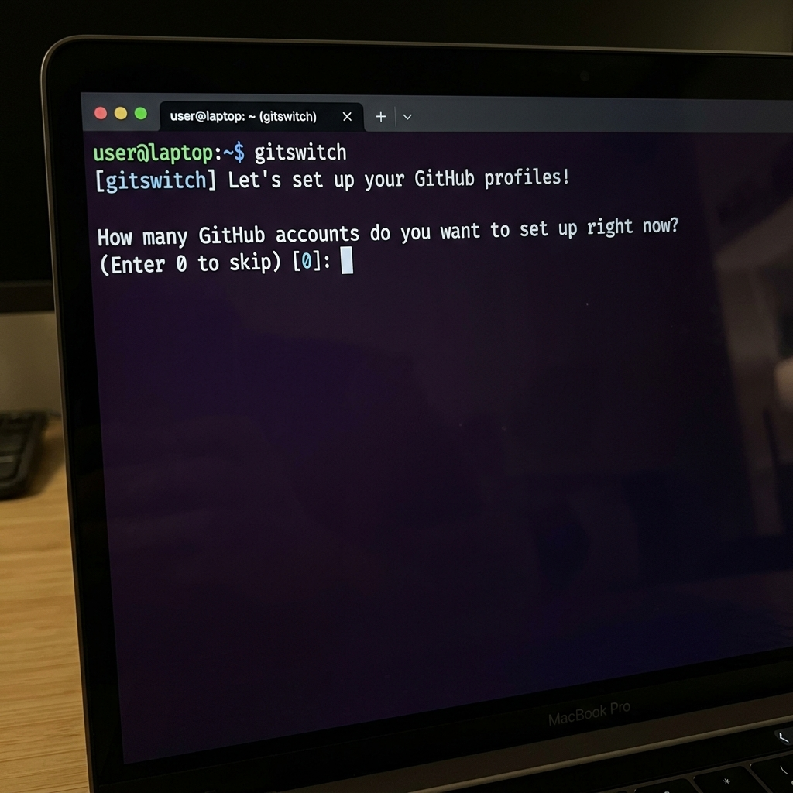
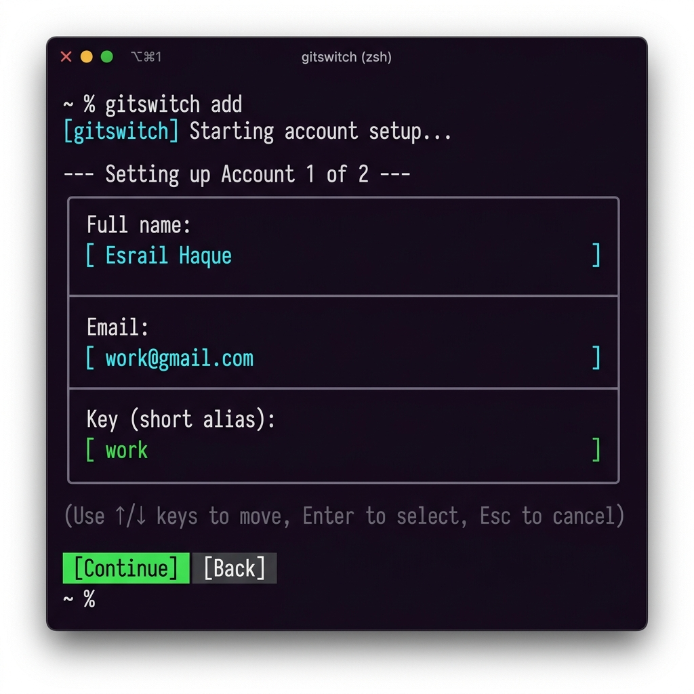
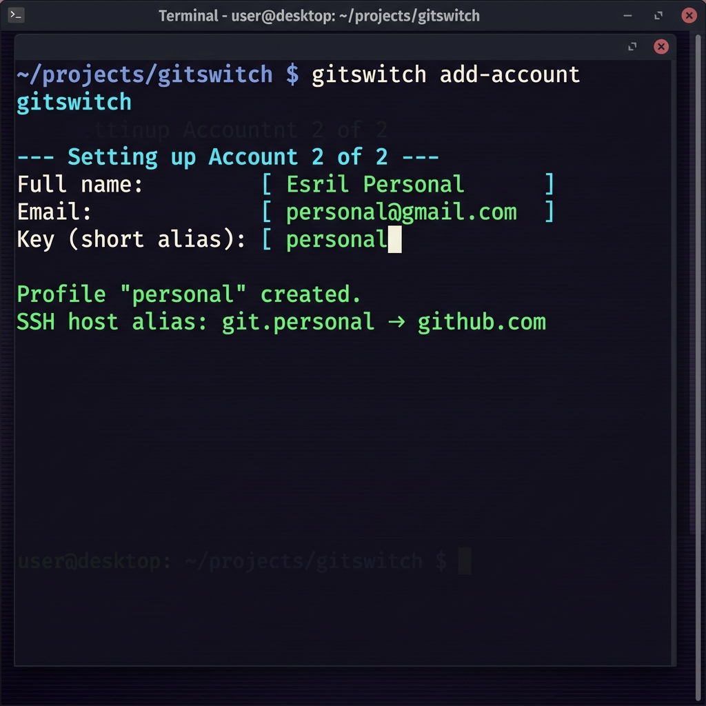
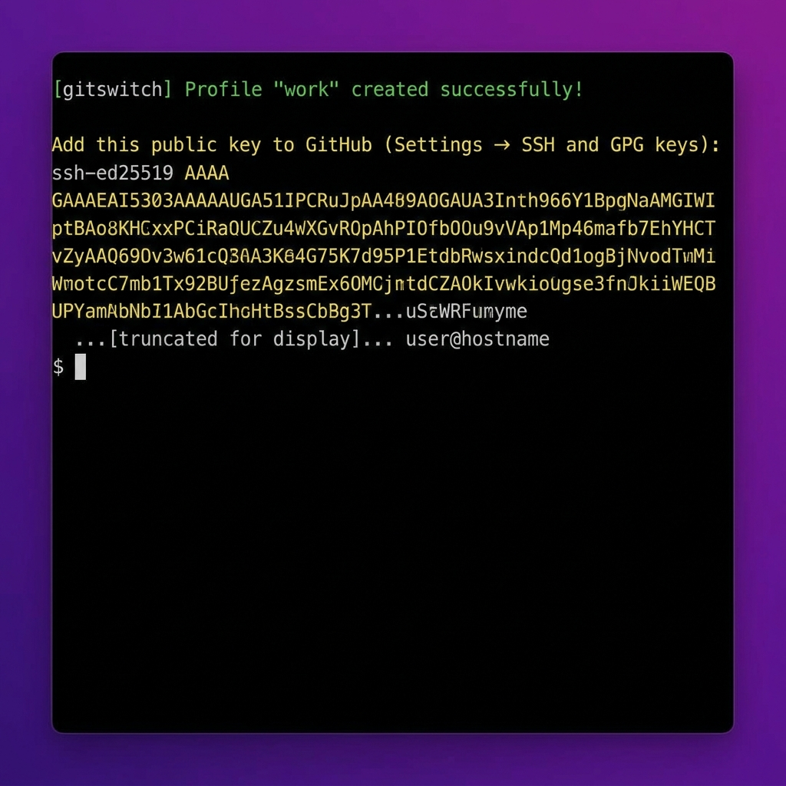

# gitswitch

Manage multiple GitHub SSH profiles on a single machine. `gitswitch` wraps `git` — all unknown subcommands are forwarded transparently to git.

## Features

- **Profile Management**: Generate and manage multiple SSH keys (e.g., `work`, `personal`) effortlessly.
- **Auto-Setup**: The installation script interactively guides you to set up your profiles right away.
- **Interactive TUI**: Beautiful, animated arrow-key menus for selecting and creating profiles.
- **Auto-Alias**: The installer automatically aliases `git` to `gitswitch` in your shell (`zsh`/`bash`/`PowerShell`). You just type `git clone` as usual!
- **Auto-Routing**: Automatically maps clone and remote URLs to the correct SSH identity.
- **Git Passthrough**: Fully compatible with all `git` commands. `gitswitch` intercepts what it needs to and forwards everything else.

## Installation


### Quick install (Linux / macOS)

```bash
curl -fsSL https://raw.githubusercontent.com/ESRAILHAQUE/gitswitch/main/scripts/install.sh | bash
```

To install into `~/.local/bin` (no sudo), override the location:

```bash
curl -fsSL https://raw.githubusercontent.com/ESRAILHAQUE/gitswitch/main/scripts/install.sh | bash -s -- --install-dir ~/.local/bin
```

### Windows (PowerShell)

**Prerequisites:** [Git for Windows](https://git-scm.com/download/win) (choose "Git from the command line and also from 3rd-party software") and an OpenSSH client.

```powershell
irm https://raw.githubusercontent.com/ESRAILHAQUE/gitswitch/main/scripts/install.ps1 | iex
```

### go install

If you have Go installed, you can easily install the latest version:

```bash
go install github.com/ESRAILHAQUE/gitswitch@latest
```

---

## Quick start

### Step 1: Install and Choose Accounts
After running the installation command, the script will automatically ask how many GitHub accounts you want to set up:


### Step 2: Configure First Account (e.g., Work)
Provide your name, email, and a short alias (e.g., `work`) for the first profile:


### Step 3: Configure Additional Accounts (e.g., Personal)
Set up your second profile (e.g., `personal`) to keep things separate:


### Step 4: Add SSH Key to GitHub
Finally, copy the generated SSH keys and add them to your GitHub settings (`Settings -> SSH and GPG keys`):


---

### Basic Commands

*(Note: If you used the installer, `git` is automatically aliased to `gitswitch`. You can use `git` directly!)*

```bash
# Clone a repository using a specific profile
git clone work:myorg/myrepo

# In an existing local repository, initialize and attach a profile
git init

# Add a remote (gitswitch automatically rewrites HTTPS URLs to use your SSH profile)
git remote add origin https://github.com/myorg/myrepo

# View all your configured profiles
git list
```

## Commands

*(If you didn't set up the alias, use `gitswitch` instead of `git` for these commands)*

- `git gen`: Interactively creates a new SSH profile.
- `git init`: Initialises a git repo (if needed) and sets `user.name` / `user.email` from a profile.
- `git clone`: Clones a repository using a profile key or an HTTPS URL.
- `git list`: Lists all registered profiles.
- `git fix`: Rewrites an existing GitHub HTTPS remote to SSH using a chosen profile.
- `git del`: Removes a profile.

Any other unrecognised subcommand is forwarded to `git`.

## Configuration

Profiles are stored securely in `~/.config/gitswitch/profiles.json`.
Keys and host mappings are saved into `~/.ssh/gitswitch_<key>` and `~/.ssh/config`.
